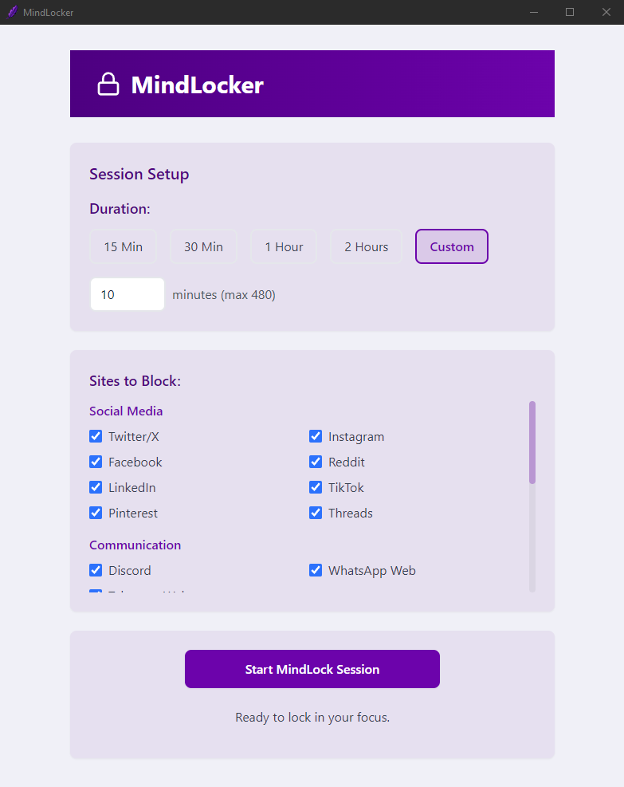

<div align="center">

<p>
	<a href="https://github.com/Microck/MindLocker">
		
	</a>
</p>

<h1>MindLocker</h1>

<p>
	<strong>An open-source desktop app to block distracting websites and boost your focus.</strong>
</p>

<p>
	</a>
	</a>
	</a>
</p>

</div>

MindLocker is a simple yet powerful desktop application for Windows designed to help you reclaim your focus. Block distracting websites like social media, news, and streaming services for a set duration so you can get deep work done.

## Features

-    **Focus Sessions:** Block distracting sites for a set duration with a single click.
-    **Customizable Blocklist:** Choose from a pre-defined list of common distractions.
-    **System-Level Blocking:** Modifies the system's hosts file for effective, browser-agnostic blocking.
-    **Clean & Modern UI:** A simple, intuitive interface built with React and Tailwind CSS.
-    **Portable:** Packaged as a single `.exe` file that requires no installation.

<div align="center">

</div>

## Installation

The easiest way to use MindLocker is to download the latest release.

1.  Go to the [**Releases Page**](https://github.com/Microck/MindLocker/releases).
2.  Download the `MindLocker-X.X.X.exe` file from the latest release.
3.  **Run the executable as an administrator** (right-click -> "Run as administrator"). This is required for the app to modify the hosts file.

## Building from Source

To build and run this project yourself, you will need [Node.js](https://nodejs.org/) and [Python](https://www.python.org/) installed on your system.

1.  **Clone the repository:**
    ```sh
    git clone https://github.com/Microck/MindLocker.git
    cd MindLocker
    ```

2.  **Set up the Python backend:**
    ```sh
    # Create and activate a virtual environment
    python -m venv venv
    .\venv\Scripts\activate

    # Install Python dependencies
    pip install -r requirements.txt
    ```

3.  **Set up the Frontend & Electron:**
    ```sh
    # Install Node.js dependencies
    npm install
    ```

4.  **Run the final packaging command:**
    This command bundles the Python script, builds the React app, and packages everything into a portable `.exe`.
    ```sh
    npm run package
    ```

5.  **Find the application** in the `dist_electron` folder and run it as an administrator.

## License

This project is licensed under the **MIT License**. See the [LICENSE](LICENSE) file for details.
